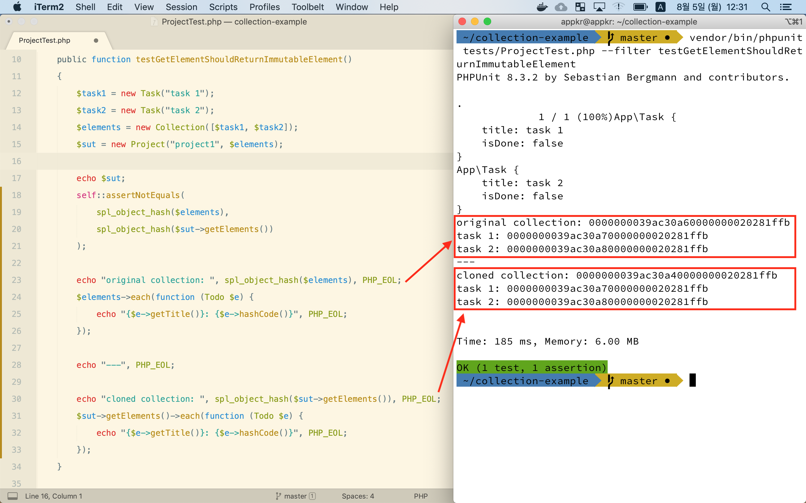

## Collection Example

- Illuminate Collection
- First Class Collection
- [Composite Pattern](https://docs.google.com/presentation/d/1Eha0ExQ-NmreewP7uZhXTIEJYu0HSdE2BGjsH_-MW4c/edit?usp=sharing)
- Persist the composite
    - Eloquent
    - Doctrine

### 3 types of operations
```
+--------+    +--------+    +--------+    +--------+    +--------+
| Source | -> | filter | -> | sortBy | -> | map    | -> | all    |
+--------+    +--------+    +--------+    +--------+    +--------+
```
- source: scalar/associative array, Collection
- intermediate(returns a Collection): `map`, `filter`, `where`, `sortBy`...
- terminal(returns a non-Collection): `all`, `implode`, `reduce`, ...

### Mutable vs immutable
- mutable: `each`
- immutable: `filter`

### Deep copy vs Shallow copy
The following image shows the example of shallow copy. Even though, the collection was newly created, but the items in the collection are the same as before. 


- Shallow copy(얕은 복사): https://github.com/appkr/collection-example/blob/master/src/Project.php#L23-L26
- Deep copy(깊은 복사): https://github.com/appkr/collection-example/blob/master/src/Doctrine/Todo.php#L105-L118

### To start from scratch
```bash
mkdir collection-example
cd collection-example

git init
echo ".idea" >> .gitignore
echo "vendor" >> .gitignore

echo "{}" > composer.json
composer require "illuminate/support"
composer require "phpunit/phpunit" --dev

mkdir src tests

git add . && git commit -m 'Project created'
```
